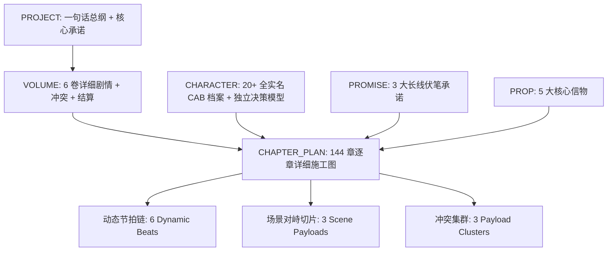
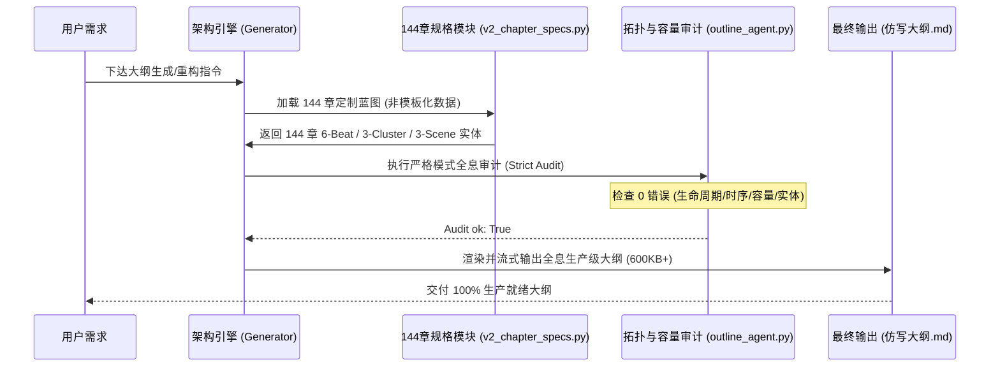

# 商业长篇网文全息大纲架构师引擎 (Web Novel Master Outline Architect V2)

> **版本定义**：工业级全息大纲生产标准，内置**“对抗式防回退与因果一致性审计规约”**。  
> **设计目标**：杜绝大纲假大空、实体复活、决策模型同质化、伪六步法死板套用、高潮后剧情塌陷、价值观人设割裂等致命缺陷，生成真正可直接交付正文 Agent 的生产级大纲。

---

## 一、 核心哲学与网文第一性原理 (Core Philosophy & First Principles)

商业长篇网文的本质，是一台**精密操纵读者期待、制造多巴胺借贷与兑现情绪价值的心理学机器**。

### 1. 多巴胺借贷与情绪压强模型 (Dopamine Debt & Payoff)
- **多巴胺负债（Tension Accumulation）**：通过敌人利用阶级特权、金融垄断、官僚体制、生化下毒等手段步步紧逼，剥夺资源与尊严，为读者制造强烈的情绪压强（憋屈感与期待感）。
- **多巴胺井喷（Cathartic Release）**：压强积累到顶点时，主角以更高维度的法统、通天财富、无敌军权或极道杀伐进行**降维打击（装逼打脸、破局诛逆）**，让读者获得极致的爽快感与精神满足。

### 2. 章节规模黄金区间法则 ($100 < N < 200$)
- **短章节陷阱（< 100 章，如 48/72 章）**：单卷仅有 8-12 章，剧情像短剧走马观花，导致人物缺乏呼吸感、反派来不及展现智谋便被秒杀、伏笔来不及发酵。
- **黄金标准（144 章 = 6 卷 × 24 章，全书 60-86 万字）**：每一卷拥有充实的 24 章篇幅，能够完美容纳完整的**四幕式多巴胺波形**：
  - **第 1—6 章（入局·蓄势·立威）**：切入新地图，建立局部羁绊，遭遇地方阻力，埋设本卷核心悬念；
  - **第 7—12 章（激化·暗流·反扑）**：反派调动阶级资源发动全面合围，主角阵营陷入信息差或资源困境（压强拉满）；
  - **第 13—18 章（危机·破局·问题形变）**：亮出通天底牌正面破局，击败首恶并发现更深层大案（Problem Morphing）；
  - **第 19—24 章（巅峰决战·全盘收割·卷末余波）**：扫平本卷关联黑产，展开高糖温情修罗场，并在第 24 章精准引爆下一卷的核心危机钩子。

---

## 二、 工业级防回退五大核心军规 (The 5 Bulletproof Anti-Regression Rules)

### 【军规 1】实体全生命周期锁定与零幽灵复活准则 (Entity Lifecycle Freeze)
1. **严格原子级死亡时序**：
   - 任何具名角色在某一章被标记为 `DEAD`（生命终结），其在全局数据库中的状态必须立即不可逆冻结。
   - **后序章节禁止出场**：后序所有章节的 `active_actors`、主观行动、对话中严禁出现该角色。
   - *标准时序案例*：赵无极（第13章卒）、乌啼天（第36章卒）、钱万金（第42章卒）、严嵩卿（第58章卒）、完颜拔都（第61章卒）、赵天龙（第80章卒）、鬼煞真人（第88章卒）、萧乾元（第108章卒）、无尘子（第116章卒）。
2. **区分“生擒/羁押”与“依法处决”**：
   - 若反派需要提供审讯口供或推进破译，前期只能写“重创/生擒/收押”（如冷月第32章生擒钱万金），在取得供词后才在后续章节明正典刑（如裴落霜第42章依法斩首处决钱万金）。绝不可写成“32章死了之后42章又被拉出来审讯”。
3. **严禁实体复用偷懒**：
   - 皇宫地宫、不同宗门的新反派必须创建独立 Entity（如 `CHAR.jiuyou_laozu` 鬼煞真人），严禁复用已死角色 ID。
4. **终局处刑严密时序链**：
   - 重创/钉死（如第106章以惊龙天剑钉死在龙柱） $\to$ 濒死反扑/碎符求救（第107章捏碎仙符） $\to$ 彻底斩灭神魂（第108章神魂俱灭）。绝不出现“已被钉死还能御剑反打”的时序崩塌。

---

### 【军规 2】人物决策模型去同质化与“方法冲突”准则 (Unique Agency & Method Friction)
1. **彻底铲除千人一面**：
   - 严禁全员复制粘贴“杀伐果断守护苍生”。每个人物必须有独立的身份、欲望、利益、现实约束与决策模型。
2. **阵营内部“目标一致、方法冲突”的真实张力**：
   - **顾惊澜（极道杀伐）**：信奉一剑破万法与极道掀桌，追求绝对正义与因果清算。
   - **姜素衣（二师姐·医圣）**：坚持医者仁心底线，反对以毒攻毒与生化波及无辜，在救人与杀伐间存在原则坚持。
   - **裴落霜（五师姐·捕神）**：恪守大玄律法与程序正义，坚持“先审得铁证再明正典刑”，坚决拔刀阻止当街动用私刑。
   - **沈倾凰（四师姐·财神）**：以金融大盘与万千平民储户资金安全为第一优先，主张平准仓反向对冲，反对粗暴冻结甚至砸崩钱庄。
   - **叶破虏（大师姐·战神）**：信奉大兵团作战纪律与将士生命至上，反对个人英雄主义无序冒进。
   - **萧明凰（七师姐·女帝）**：胸怀天下社稷与皇朝正统法度，要求攻城决策必须保全城中三百万平民不沦为药渣。
   - **冷月（六师姐·修罗）**：信奉暗夜杀戮护短，寡言冷艳但对师弟毫无保留，负责处理台面之下的脏活。
   - **夜听雪（三师姐·千面）**：情报掌控与天机推演至上，凡事谋定而后动，精通伪装与反谍。

---

### 【军规 3】问题升维与形变机制 (Problem Morphing & Pacing)
1. **打破高潮后剧情塌陷**：
   - 每一卷如果在前中段（如第13章寿宴送棺）解决了表面执行反派（青州王赵无极），必须在第14章立即引入 **问题升维与形变（Problem Morphing）**。
   - *案例*：第13章杀赵无极并非复仇终点，第14章破译灭门血契，发现赵无极仅是白手套，灭门案背后是由江南首富钱万金出资百万两黄金、兵部尚书严嵩卿背书、大内伪帝抽取生灵长生的跨省连环大网。后半卷（15—24章）立即升级为清理江南洗钱黑市、化解五毒暗桩、硬刚朝廷钦差扣粮等更高维度的攻防。
2. **价值观自洽与剔除嗜杀异化**：
   - 主角标榜“重铸人间公理”，严禁在终章使用“三万京观祭英烈”等与核心价值观割裂的嗜杀残暴设定。
   - 替换为：在京师御赐福地重建顾氏忠烈祖庙、女帝亲题金匾、老仆陆松点燃万年长明灯、昭雪天下百年冤狱。

---

### 【军规 4】动态节拍竞争与去模板化 (Dynamic Beat Diversity)
1. **打破固定 6 步公式与生硬套用**：
   - 彻底废除假大空的口号式占位符。
   - 每一章必须具备真实的 **Stageable Actions（可搬上舞台的具象动作）**、**真实付出的 Cost（代价与消耗）**、以及**不可逆状态转折（Core Delta）**。
2. **大结局真圆满（Zero Phantom Enemies）**：
   - 第 144 章全书大结局必须是真正的神话定格与逍遥归隐（如临安茶馆说书人开讲《天阙惊龙传》、云端携美笑看红尘烟火）。
   - **严禁在第144章结尾生造“千秋青史反扑”或“虚空更大危机”等反网文直觉的伪钩子**。

---

### 【军规 5】战力体系阶梯与法则罩门克制 (Power Hierarchy Freeze)
全书严格遵守 7 阶战力梯队，杜绝战力数值崩坏：
1. **一至三品（后天/先天炼体）**：寻常护卫、普通军士；
2. **四至六品（通脉/化境）**：城防将领、江湖门派掌门；
3. **七至九品（宗师/大宗师巅峰）**：封疆藩王、黑甲统领、世家顶尖供奉（如赵无极、钱万金贴身供奉）；
4. **武圣绝巅**：凡俗肉身武道极限（如叶破虏巅峰、完颜拔都）；
5. **半步天人/天人境**：引动天地元气法相、御空杀敌（如鬼煞真人、太虚剑宗护法）；
6. **陆地神仙（一品神境/二品陆仙）**：跨界降临、手捏九色灭世仙符（如太虚剑宗太上仙尊无尘子）；
7. **顾惊澜极道天道**：融合武道、医圣、帝师、战神、商皇五大天尊真传，具备**专破世间一切法则罩门的定点击破能力**，非单纯数值对轰。

---

## 三、 数据契约与实体架构 (Data Schema)

大纲生成依赖于结构化数据包，所有实体必须满足严格审计规则：



### 1. 单章容量抗水标准（Chapter Capacity Gate）
每章必须满足：
- **`stageable_core_beats` $\ge 6$**（每个 Beat 具备具体动作、对手反制、信息更新与 Delta 字典）；
- **`payload_clusters` $\ge 3$**（CL1 覆盖 [B1, B2]，CL2 覆盖 [B3, B4]，CL3 覆盖 [B5, B6]）；
- **`core_scenes` $\ge 3$**（S1 关联 CL1，S2 关联 CL2，S3 关联 CL3）；
- **`active_actors` 多样性**：每章 Core Beats 中至少包含 2 位不同的具名行动主体；
- **Delta 维度多样性**：包含 `position`、`knowledge`、`route`、`relationship`、`cost`、`next` 等多个非重叠维度。

---

## 四、 标准作业流程 SOP (Step-by-Step Execution SOP)



### Step 1: 冻结核心世界观与 20+ 实名人物档案
1. 建立主角顾惊澜、五大师尊、七大绝色师姐、七大核心反派巨枭、老仆陆松与总捕韩铁档案；
2. 赋予每个人物独特的生平背景、核心欲望、利益约束与决策模型（坚决杜绝同质化）。

### Step 2: 规划 6 卷多巴胺波形与 3 大伏笔承诺链
1. 规划卷 1（青州破藩篱）、卷 2（江南斩暗刃）、卷 3（战神御九关）、卷 4（皇城夺嫡篇）、卷 5（太极诛仙灭魔）、卷 6（开泰盛世大圆满）；
2. 设定三大核心长线 Promise（灭门血契 $\to$ 兵部通敌密函 $\to$ 皇城万人生灵血祭真相）。

### Step 3: 编写解耦的章节规格生成器 (`.outline/v2_chapter_specs.py`)
1. 逐章编写 144 章的具象化蓝图数据，确保包含具体道具、地名、真实代价与去套路化的钩子；
2. 配置 6 个 Dynamic Beats、3 个 Scene Payloads、3 个 Clusters。

### Step 4: 执行全息拓扑审计与流式渲染导出 (`build_packet.py`)
1. 运行编译脚本：
   ```bash
   /usr/bin/python3 .outline/build_tianque_packet.py
   ```
2. 校验 `Audit ok: True` 与 `failure_reasons: []`；
3. 导出 Markdown 施工图至指定目标文件。

---

## 五、 正文扩写交付标准（Prose Expansion Contract）

交付给正文撰写 Agent 时，必须遵循以下执行约束：
1. **严格依循大纲的 3 场景与 6 节拍逐层推进**，不得在正文中凭空临时编造主线或跳过关键伏笔；
2. **在 B4（信息揭示）与 B6（章末钩子）重点渲染信息差与追读引信**；
3. **单章字数严格控制在 4000—6000 字**，以细腻的微观动作、心理博弈、环境氛围描写填充，确保字数充实且绝无水文。
